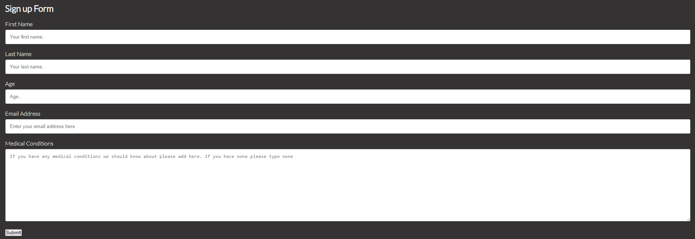
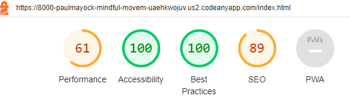
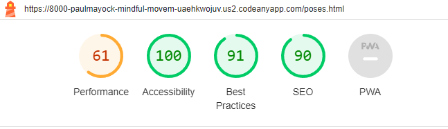
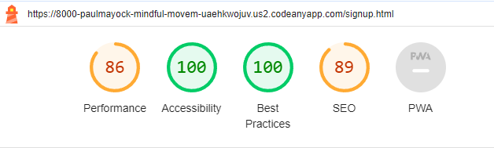
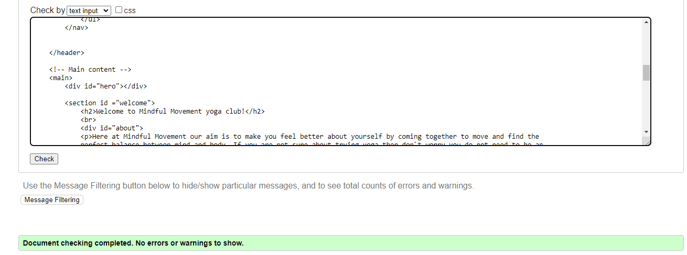
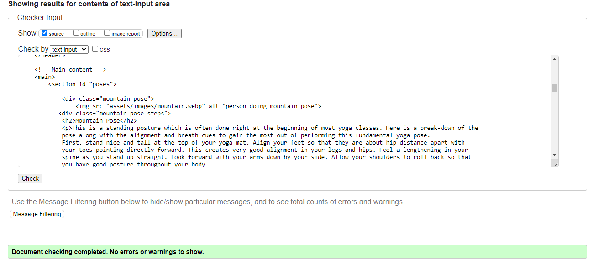
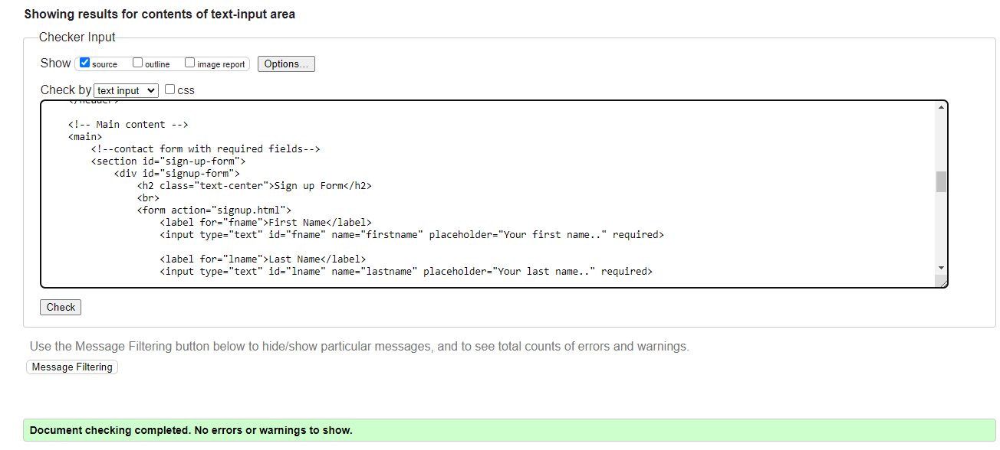

# Mindful Movement

Mindful movement is a yoga website which shows users some of the main poses when doing yoga. The poses also include some images of each pose to give the user a better understanding of the stance. The website also gives the user the opportunity to sign up to the yoga club along with contact details and links to our social media.

## Features

### o   Header

o	This menu contains links to Home, Poses and Sign up page and will allow users to navigate between menus.

o	On smaller screens the menu will change to a dropdown symbol called more so the menu will fit on smaller screens and the user can navigate the menu from there.

o   Footer

o	On the left of the footer it will feature contact info including phone number and email to contact Mindful Movement.

o	Underneath the contacts will include links to social media. When clicked on these links will open new tabs.

### o   Favicon

o	The Mindful Movement logo will show on the tab page so user know which tab the website is on.

## Landing page

o	This will be an image of the Mindful Movement logo. Below this will include a welcome message of what the aim of the club is. It also points to the poses and sign up if users are interested.

## Techniques page

o	The aim of this page is to show the user some of the most popular yoga poses. There are six poses featured. Each pose will give step by step instructions on how to move into each pose.

o	The page also contains an image for each pose so the user can have a better understanding of what position their body should be in when attempting each pose.

## Sign up page

o  The aim of this page is for users who wish to sign up to the yoga club can do so by filling out their information. All fields are required so no information from the user can be left blank.

## Design

o	Wireframe

o	Home page

## Features

o	Responsive design

o	Clickable contact links which open app to contact yoga club

o	Sign up form with required fields

## Desired features not implemented

o	Thank you page and return to main page when sign up form has been completed

o	A timetable showing monthly classes and a booking system to sign up.

## Technologies

### o	HTML

o	The structure of the Website was developed using HTML as the main language.

### o	CSS

o	The Website was styled using custom CSS in an external file.

### o	Codeanywhere

o	The website was developed using Codeanywhere IDE.

### o	GitHub

o	The source code is hosted on Github and deployed using Git pages.

### o	Favicon

o	Favicon files created on <https://www.favicon-generator.org/>

### o	Font Awesome

o	Social media Icons downloaded using <https://fontawesome.com/>

### o	Cloud convert

o	To convert images to WEBP format to website was used <https://cloudconvert.com/>

### o	123rf

o	Used to create the mindful movement logo www.123rf.com

### o	balsamiq

o	wireframes were created using balsamiq from <https://balsamiq.com/wireframes/desktop/#>

## Websites

### o	W3schools

o	Website used to research HTML and CSS functions <https://www.w3schools.com/>

### o	Mind body green

o	Site used to research steps for yoga poses www.mindbodygreen.com

### o	Maji sports

o	Site used to research steps for yoga poses www.majisports.com

### o   Wave webaim

o   Site used to test the accessibility of the website

## Testing

### Responsiveness

All pages were tested to ensure responsiveness on screen sizes from 320px and upwards as defined on browsers including Chrome and Firefox.

Steps to test:

1. Open browser and navigate to [Mindful Movement](https://8000-paulmayock-mindful-movem-uaehkwojuv.us2.codeanyapp.com/index.html)
2. Open the developer tools (right click and inspect)
3. Set to responsive and decrease width to 320px
4. Set the zoom to 50%
5. Click and drag the responsive window to maximum width

Expected:

Website is responsive on all screen sizes and no images are pixelated or stretched. No horizontal scroll is present and no elements overlap.

Actual:

Website behaved as expected with the exception of switching to landscape view in Mozilla Firefox. Details can be found in [Unfixed Bugs](#unfixed-bugs)

### Accessibility

Testing was focused to ensure the following criteria were met:

o Color contrasts are applied for an easy to view on users vision

o Heading levels are npplied to ensure the importance of content is relayed correctly to the end user

o All content is contained within landmarks to ensure ease of use for assistive technology, allowing the user to navigate by page regions

o HTML page lang attribute has been set

o Aria properties have been implemented correctly

o WCAG 2.1 Coding best practices being followed

### Lighthouse Testing

Below shows the results for each page when tested using lighthouse testing.

o Home

o Poses

o Sign up

### Functional Testing

o **Navigation links**

Testing was performed to ensure all navigation links on all pages navigated to the correct pages as per design. This was done by clicking on the navigation links on each page.

| **Navigation Link** | **Page to Load** |
| ----------- | ----------- |
| Home | index.html |
| Poses | poses.html |
| Sign up | signup.html |

**Footer/Social media links**

Testing was performed on the social media icons on the footer to ensure when clicked on each opened a new tab and each one had a hover effect applied.
Each item opened a new tab correctly.

**Footer/Contact details links**

Testing was performed on the footer email and phone number links to ensure when clicked on each link opened an app for the user to use to contact Mindful Movement.

*Steps to test phone number*

1. Navigate to Mindful Movement home page
2. Click on the phone number in the footer

Expected:
A window appears asking the user to choose a device to call from.

Result:
Behaviour was as expected.

*Steps to test email*

1. Navigate to the Mindful Movement home page
2. Click on the email address in the footer

Expected:
A window pops up asking the user what email app they would like to use to send a email.

Result:
Behavious is as expected.

**Sign up form testing**
The sign up form was tested to ensure each function worked as it should when correct and incorrect data was input.

*Test one - Correct Inputs*

Steps to test:

1. Navigate to the mindful movement sign up page
2. Input the following data:

o First Name: John

o Last Name: Smith
o Age: 32

o Email: johnsmith@gmail.com

o Medical Condition: None.

1. Click Submit

Expected:

Form submits with no warnings or errors and sign up page refreshes.

Actual:

Website behaved as expected with no errors or warnings and sign up page refreshed.

*Test Two - Missing Required Field First Name*

Steps to test:

1. Navigate to the sign up page
2. Input the following data:

o First Name:

o Last Name: Smith

o Age: 32

o Email: johnsmith@gmail.com

o Medical Condition: None.

3. Click Submit

Expected:

The form does not submit and an Error is displayed saying please fill out this field.

Actual:

Website behaved as expected, error message was displayed and the form did not submit.

Test  Three - Missing Required Field Last Name

Steps to test:

1. Navigate to the sign up page
2. Input the following data:

o First Name: John

o Last Name:

o Age: 32

o Email: johnsmith@gmail.com

o Medical Condition: None.

3. Click Submit

Expected:

The form does not submit and an Error is displayed saying please fill out this field.

Actual:

Website behaved as expected, error message was displayed and the form did not submit.

*Test Four - Missing Required Age*

Steps to test:

1. Navigate to the sign up page
2. Input the following data:

o First Name:John

o Last Name: Smith

o Age:

o Email: johnsmith@gmail.com

o Medical Condition: None.

3. Click Submit

Expected:

The form does not submit and an Error is displayed saying please fill out this field.

Actual:

Website behaved as expected, error message was displayed and the form did not submit.

*Test five - Incorrect email format*

Steps to test:

1. Navigate to the sign up page
2. Input the following data:
   
o First Name:John

o Last Name: Smith

o Age: 32

o Email:

o Medical Condition: None

3. Click Submit
   
Expected:

The form does not submit and an Error is displayed saying please fill out this field.

Actual:

Website behaved as expected, error message was displayed and the form did not submit.

*Test six - Missing required medical condition*

Steps to test:

1. Navigate to the sign up page
2. Input the following data:

o First Name:John

o Last Name: Smith

o Age: 32

o Email: Johnsmith@gmail.com

o Medical Condition:

3. Click Submit

Expected:

The form does not submit and an Error is displayed saying please fill out this field.

Actual:

Website behaved as expected, error message was displayed and the form did not submit.

### Validation Testing
o HTML

   o No errors returned using the offical W3C validator
   
   

   

   

### Unfixed Bugs 

Responsiveness of the website worked on all devices, screen sizes and orientation. An issue I encountered was the landscape orientation on mozilla firefox. The issue here was the menu header on the home page was placed left of the screen. However this appeared to fix itself and I was unable to determine what the cause to this issue was.

## Deployment

### Controls

The site was created using the Codeanywhere code editor and pushed to github to the remote repository 'mindful-movement'.

The following git commands were used throughout development to push code to the remote repo:

**git add .** - This command was used to add the file(s) to the staging area before they are committed.

**git commit -m “commit message”** - This command was used to commit changes to the local repository queue ready for the final step.

**git push** - This command was used to push all committed code to the remote repository on github.

### Deployment to Github Pages

o The site was deployed to GitHub pages. The steps to deploy are as follows:

    o In the GitHub repository, navigate to the Settings tab
    
    o From the menu on left select 'Pages'
    
    o From the source section drop-down menu, select the Branch: main
    
    o Click 'Save'
    
A live link will be displayed in a green banner when published successfully.
Thewebsite live link is as follows - https://paulmayock.github.io/mindful-movement/

## Credit

**o Code Institute**

    o Notes were followed using the HTML Essentials, CSS Essentials and Love Running project as a guidance to the outline HTML and CSS code.

**o W3schools**

    o Website used to search certain HTML and CSS fucntions.

**o Mind body green**

    o Site used to research steps for yoga poses www.mindbodygreen.com

**o Maji sports**
    
    o Site used to research steps for yoga poses www.majisports.com

**o 123rf**

    o Used to create the mindful movement logo www.123rf.com    

### Content

All content with the exception of those listed in the Technologies, Websites and above Credit section of this document was created by myself.